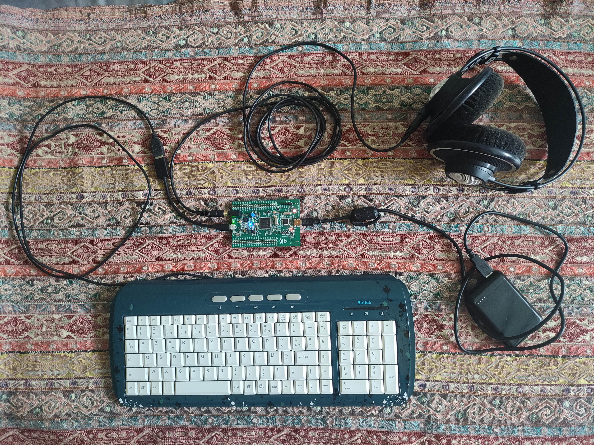

# Stocharythm Box §§ Bruitenkor ! 

## A new drum machine for STM32F4 Discovery kit
## Electronic free jazz ready !

  

Funny and strange **drum machine** controlled by any PC USB AZERTY/QWERTY keyboard plugged into the board.  
You'll need an mini USB B plug to USB A receptacle OTG adapter.  
The STM32F4 Discovery kit acts as a USB host for the keyboard.  
To test the synth, flash the board with the ELF binary : **Stocharythm_box_release.elf** (You can use *STM32CubeProgrammer* software).  
There are also two long sound tracks in zz_sound_demos folder.  

Work In Progress !!  

**Features** :  
9 voices at the moment :  
- 6 sample players which can access to 41 famous short samples (800kB)  
- 1 sampled kick (no more Synthetic Bass Drum  (DaisySP/ Emilie Gillet) because too greedy...)
- 1 white noise with ADSR  
- 1 808 snare  

Adjustable pan for each instrument.  
FX : simple stereo reverb based on Freeverb (in freeverb_stm32.hpp).  
Stereo output.  

The sequencer is not step based. You define a loop duration and call for sound events which are randomly dispatched in the loop.  
These are so-called "stocharythms".  You can however quantize their position on a defined grid.
You can also do live recording !  

Many debug messages through UART (Pin PA2). Please configure your serial port terminal to ISO-8859-15 encoding.    

To improve :  
[x] noise during UART transmissions  
[x] add stereo placement  
[ ] make debug messages optional  
[x] remove clicks at the end of some samples  
[ ] mute/unmute instruments  
[x] delete instrument events in loop  
[x] more LED indicators  

- - - - 
### Keyboard control :  
*Single key controls* :  just hit the key !  
- `+` and `-`   -> final volume (Output DAC)  
- `(` and `)` or arrows up and down -> source volume  
- `.`  -> clear loop  
- `space` -> play/pause sequencer (toggle)  
- `!` -> play/stop sequencer (toggle)    
- left and and right arrows : slow down or speed up  
- `*` -> start live recording  
- `/` -> stop live recording  
- `n` -> add 2 random events  
- `b` -> delete 2 random events  
- `T` : add 1 event played by instrument 0 / `t` : play or record instrument 0  
- `Y` : add 1 event played by instrument 1   / `y` : play or record instrument 1  
- `U` : add 1 event played by instrument 2   / `u` : play or record instrument 2  
- `I` : add 1 event played by instrument 3   / `i` : play or record instrument 3  
- `O` : add 1 event played by instrument 4   / `o` : play or record instrument 4  
- `P` : add 1 event played by instrument 5   / `p` : play or record instrument 5  
- `H` : add 1 Synthetic Bass Drum event / `h` : play or record Synthetic Bass Drum  
- `J` : add 1 white noise event  / `j` : play or record white noise  
- `K` : add 1 808 snare event   / `k` : play or record snare  
- `m` : mix up all events in loop  
- `q` : quantize all events on an 8 steps loop (original position is lost)  
- `z` : change the 6 samples  
- `a` : randomize velocities of events at the beginning of each loop (toggle)  
- `v` : randomize velocities of all events
- `s` : display sequencer status  
- `d` : display list of events in the loop  

*Multi key commands* :  press a sequence of keys and submit it with `enter`  
They must all start with letter `c`, no space, just comma to separate numbers.  
- `cl` : cl<*n*\>	:	Sets the loop duration at *n* x 0.1 seconds (ex : `cl20` for 2 seconds)  
- `ca` : ca<*n*\>	:	Creates *n* random events for each instrument  (ex : `ca4`)  
- `cr` : cr<*n*\>,<*instr*\>	:	Creates *n* regular events in the loop for instrument *instr*  (ex : `cr1,5` )  
- `cn` : cn<*n*\>	:	Creates *n* events  (ex : `cn10` )  
- `cq` : cq<*n*\> : Quantize events on a n steps loop (original position is lost)  

### LED indicators :  
- Orange : CPU load  (LED3)  
- Red : Beginning of each loop or error (LED5)  
- Green : live recording mode ON (LED4)  
- Blue : USB keyboard is connected (LED6)  

- - - - 
### Developer notes :
I'm using STM32CubeIDE (v2.1.1).  
This is a configurable project with ioc (STM32CubeMX) and BSP files written in C and C++.  
It should be easily tailored for other powerful STM32 mcu (cortex M33, M4, M7, M55, ...)  

**Keyboard configuration** :  
- Keyboard layout is in ``azerty_hid_map.h`` (This one is for AZERTY french keyboards, sorry)  
- For mapping single key functions, in file `bruitenkor.cpp`, modify function : `void InterpretKey(uint8_t key, uint8_t keycode)`  
- You can define new multi key functions in file ``keyb_command_parser.cpp``, don't forget to fill also the table ``static const Command commandTable[MAX_COMMANDS] = {...}``  

There are several Git branches :  
- **Stocharythm** : main one   
- Simple_demo : minimal synth platform  

<<< By *Xavier Halgand*, Summer 2025 >>>  
Thanks : Electrosmith/DaisySP, Emilie Gillet, STM32 team, ChatGPT, ...

